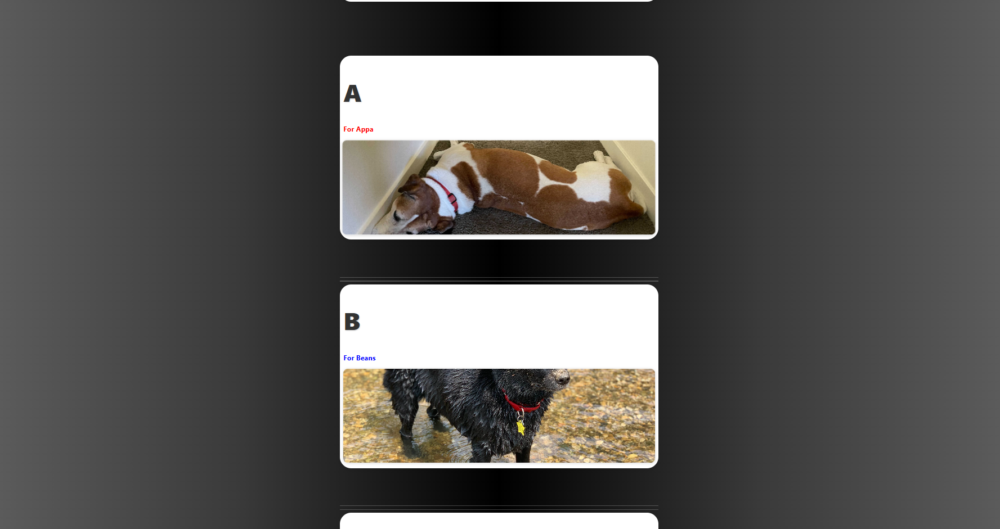
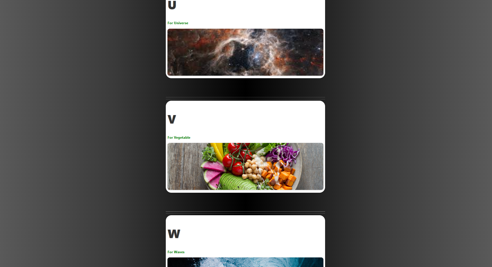

<h1 align="center"> 📸 ABC Challenge 📸</h1>

Proyecto grupal donde creamos el abecedario (A–Z) usando fotografías de objetos reales y los mostramos en una página web.  
Cada letra tiene:

- Un título con la letra (A, B, C…)
- Una pequeña descripción (`h3`)
- Una imagen relacionada (`img`)

## 👥 Integrantes del equipo

<div align="center">

<table>
<tr>
<td>

## 👥 Equipo Q-ERO v3 Protocol

- Agustín Valenzuela
- Karim Valenzuela  
- Javier Valenzuela   
- Anita Morales  
- Nicolás Peña 
- Mauricio Narváez
- Vicente Díaz


</td>
<td align="center" valign="middle" width="320">
  
</td>
</tr>
</table>

</div>


## 📸 Objetivo del Proyecto

-   Completar las 26 letras del abecedario con fotos reales.
-   Trabajar colaborativamente utilizando GitHub, branches y project
    boards.
-   Practicar HTML, CSS, JavaScript y control de versiones.
-   Aplicar metodología Scrum: tareas, issues, sprints y revisión
    grupal.

## 🧱 Secciones del Proyecto
### 🧩 Sección HTML

- Insertar imágenes para todas las letras del **ABC**.
- Corregir cualquier error visible en el código base.
- Mantener la estructura por letra:
  - `h1` con la letra (A, B, C…)
  - `h3` con el texto “For ...”
  - `img` con la foto correspondiente.

### 🎨 Sección CSS

- Vincular el archivo `style.css` en el `<head>`.
- Fondo general gris con un leve degradado.
- Todos los `h3` en **verde** por defecto.
- Crear una clase para que **3 `h3`** sean **azules**.
- Hacer que **1 `h3`** sea **rojo** usando otra clase.
- Estilizar las imágenes (`.img-thumbnail`) y el layout para que se vea limpio y centrado.

### ⚙️ Sección JavaScript

- Vincular el archivo `script.js` antes de cerrar el `</body>`.
- Crear una función que devuelva un color aleatorio entre:
  - `green`, `blue`, `red`.
- Agregar un evento `click` a todos los `h5`:
  - Cada vez que se hace clic en un `h5`, su color cambia a uno de esos 3 colores aleatorios.

Ejemplo de idea de función:

```js
function getRandomColor() {
  const colors = ["green", "blue", "red"];
  const index = Math.floor(Math.random() * colors.length);
  return colors[index];
}
```
## ✔ Estado del Proyecto

-   HTML completado\
-   CSS estilizado\
-   JS implementado\
-   Repositorio configurado\
-   Project Board creado\
-   Branches por tareas funcionando

## 📸 Vista previa del proyecto

A continuación se muestran algunas capturas del proyecto final:







